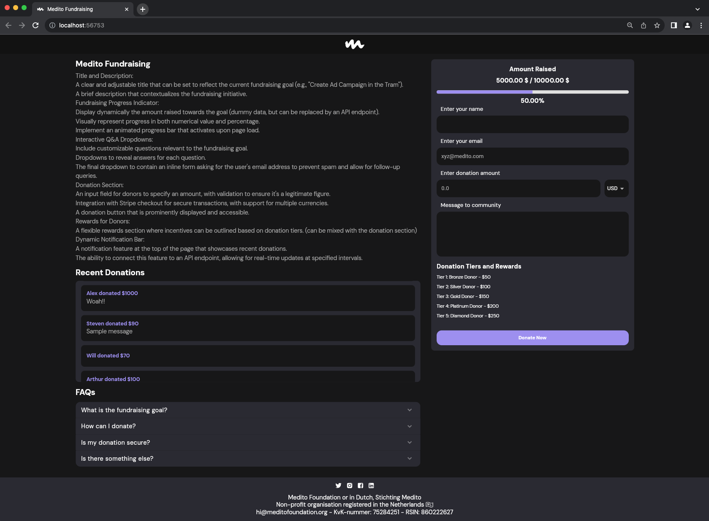

# Medito Fundraising

A Flutter web app for the Medito Fundraising
####  [Demo](https://40bbbf27.medito-fundraising-e3m.pages.dev/)



## How to run

**Step 1:**

Download or clone this repo by using the link below:

```
https://github.com/osamaasifoak/Medito-Fundraising.git
```

**Step 2:**

Go to project root and execute the following command in console to get the required dependencies:

```
flutter pub get
```

## Task to achieve

###### Title and Description:

- A clear and adjustable title that can be set to reflect the current fundraising goal (e.g., "Create Ad Campaign in the Tram").
- A brief description that contextualizes the fundraising initiative.

###### Fundraising Progress Indicator:

- Display dynamically the amount raised towards the goal (dummy data, but can be replaced by an API endpoint).
- Visually represent progress in both numerical value and percentage.
- Implement an animated progress bar that activates upon page load.

###### Interactive Q&A Dropdowns:

- Include customizable questions relevant to the fundraising goal.
- Dropdowns to reveal answers for each question.
- The final dropdown to contain an inline form asking for the user's email address to prevent spam and allow for follow-up queries.

###### Donation Section:

- An input field for donors to specify an amount, with validation to ensure it's a legitimate figure.
- Integration with Stripe checkout for secure transactions, with support for multiple currencies.
- A donation button that is prominently displayed and accessible.

###### Rewards for Donors:

- A flexible rewards section where incentives can be outlined based on donation tiers. (can be mixed with the donation section)

###### Rewards for Donors:

- A notification feature at the top of the page that showcases recent donations.
- The ability to connect this feature to an API endpoint, allowing for real-time updates at specified intervals.

## Project files structure

### `lib/widgets/*`

Here we provide shared widgets that is going to be used in multiple screens

### `lib/constants/*`

In `lib/constants` we defined our app strings, color and theme

### `lib/models/*`

These classes are responsible for data parsing and representation.

### `lib/providers*`

This directory contains the provider classes that are provided in `main.dart`. These classes represent the app state.

### `lib/views/*`

This directory contains widgets used to construct the the screen of the app.

## Deployment
* [Article](https://hrishikeshpathak.com/blog/flutter-web-hosting-cloudflare/)
* [Youtube link](https://www.youtube.com/watch?v=-FRDk9D_H8I)
